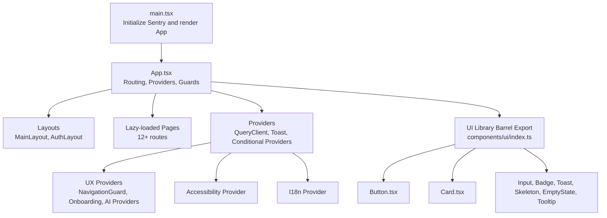
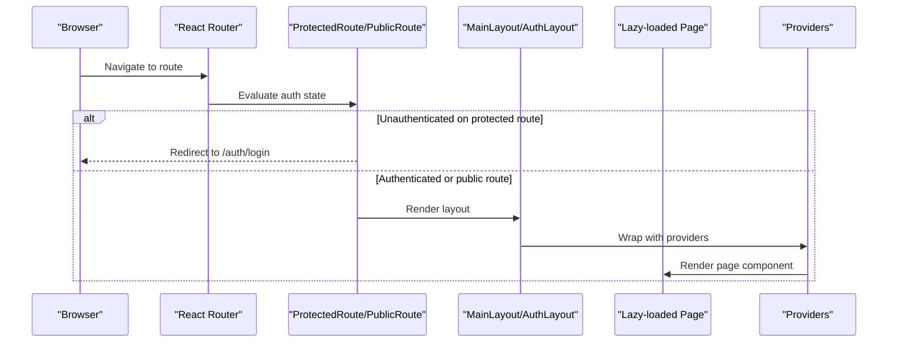
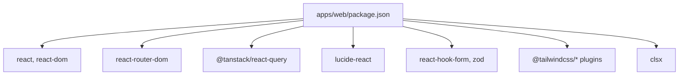

# UI Components & Design

<cite>
**Referenced Files in This Document**
- [App.tsx](file://apps/web/src/App.tsx)
- [main.tsx](file://apps/web/src/main.tsx)
- [package.json](file://apps/web/package.json)
- [WIREFRAMES.md](file://WIREFRAMES.md)
- [Button.tsx](file://apps/web/src/components/ui/Button.tsx)
- [Card.tsx](file://apps/web/src/components/ui/Card.tsx)
- [index.ts](file://apps/web/src/components/ui/index.ts)
- [DesignSystem.tsx](file://apps/web/src/components/ux/DesignSystem.tsx)
</cite>

## Table of Contents
1. [Introduction](#introduction)
2. [Project Structure](#project-structure)
3. [Core Components](#core-components)
4. [Architecture Overview](#architecture-overview)
5. [Detailed Component Analysis](#detailed-component-analysis)
6. [Dependency Analysis](#dependency-analysis)
7. [Performance Considerations](#performance-considerations)
8. [Troubleshooting Guide](#troubleshooting-guide)
9. [Conclusion](#conclusion)
10. [Appendices](#appendices)

## Introduction
This document provides comprehensive UI components and design documentation for Quiz-to-Build. It covers all 12 application pages with wireframes, navigation flows, and user journeys, details the component library (buttons, forms, cards, and interactive elements), explains the design system, typography, color schemes, and responsive design patterns, and documents accessibility features, keyboard navigation, and screen reader support. It also includes component usage examples, customization options, styling guidelines, mobile responsiveness, cross-browser compatibility, performance optimization, design tokens, theme system, component composition patterns, and guidance for extending the UI framework.

## Project Structure
The web application is a React 19 single-page application built with Vite and TypeScript. Routing is handled via react-router-dom v7, with lazy-loaded page components for code splitting. Providers include React Query for caching and optimistic updates, a toast provider for notifications, Sentry error boundary for error handling, and conditional providers for accessibility, internationalization, onboarding, predictive errors, and smart search. The UI component library is exported via a barrel export and includes reusable primitives such as Button, Card, Input, Badge, Toast, Skeleton, EmptyState, and Tooltip.

**Diagram sources**
- [main.tsx:1-23](file://apps/web/src/main.tsx#L1-L23)
- [App.tsx:189-283](file://apps/web/src/App.tsx#L189-L283)
- [index.ts:1-19](file://apps/web/src/components/ui/index.ts#L1-L19)

**Section sources**
- [main.tsx:1-23](file://apps/web/src/main.tsx#L1-L23)
- [App.tsx:189-283](file://apps/web/src/App.tsx#L189-L283)
- [index.ts:1-19](file://apps/web/src/components/ui/index.ts#L1-L19)

## Core Components
This section documents the foundational UI components and their capabilities.

- Button
  - Variants: primary, secondary, ghost, danger, outline
  - Sizes: sm, md, lg
  - States: normal, disabled, loading
  - Features: left/right icon slots, fullWidth, forwardRef for DOM access
  - Styling: uses Tailwind-like design tokens and focus-visible rings for accessibility
  - Example usage: see Button showcase in the design system demo

- Card
  - Variants: padding levels (none, sm, md, lg), optional hover elevation
  - Composition: supports header with title/subtitle/icon/action
  - Styling: light/dark mode compatible borders and shadows

- Badge
  - Variants: default, primary, success, warning, error
  - Sizes: sm, md
  - Styling: compact, consistent sizing scale

- Input
  - Props: label, error, hint, leftAddon, rightAddon
  - Accessibility: auto-generated id, aria attributes via form libraries
  - Integration: designed to work with react-hook-form and zod

- Toast
  - Provider and hook for global notifications
  - Integration: used across pages for user feedback

- Skeleton
  - Variants: generic skeleton, stat card skeleton, list item skeleton
  - Purpose: improved perceived performance during async loads

- EmptyState
  - Variants: generic, list, documents, sessions, search, notifications
  - Purpose: friendly messaging when collections are empty

- Tooltip
  - Variants: tooltip, help tooltip, label with help, info banner
  - Purpose: contextual help and guidance

**Section sources**
- [Button.tsx:1-53](file://apps/web/src/components/ui/Button.tsx#L1-L53)
- [Card.tsx:1-61](file://apps/web/src/components/ui/Card.tsx#L1-L61)
- [index.ts:1-19](file://apps/web/src/components/ui/index.ts#L1-L19)
- [DesignSystem.tsx:410-652](file://apps/web/src/components/ux/DesignSystem.tsx#L410-L652)

## Architecture Overview
The application’s UI architecture centers around:
- Routing and guards: ProtectedRoute/PublicRoute wrappers protect authenticated routes; OAuth callback routes are prioritized to avoid conflicts.
- Providers: Conditional providers enable feature flags for accessibility, i18n, onboarding, predictive errors, and smart search.
- Layouts: MainLayout and AuthLayout wrap page content; navigation is consistent across protected routes.
- Error handling: Sentry error boundary wraps the root App to catch runtime errors.
- Data fetching: React Query client configured with retry and staleTime for optimal caching behavior.

**Diagram sources**
- [App.tsx:149-187](file://apps/web/src/App.tsx#L149-L187)
- [App.tsx:202-270](file://apps/web/src/App.tsx#L202-L270)

**Section sources**
- [App.tsx:149-187](file://apps/web/src/App.tsx#L149-L187)
- [App.tsx:202-270](file://apps/web/src/App.tsx#L202-L270)

## Detailed Component Analysis

### Page 1: Login Page (/auth/login)
- Purpose: Authenticate existing users
- Key elements: Email/password fields, remember me, forgot password, create account, OAuth providers, real-time validation, error messages
- Accessibility: Proper labels, focus management, keyboard navigation, screen reader announcements for errors and success states
- Responsive: Full-width form with touch-friendly controls

**Section sources**
- [WIREFRAMES.md:7-50](file://WIREFRAMES.md#L7-L50)

### Page 2: Registration Page (/auth/register)
- Purpose: Create new accounts
- Key elements: Name, email, password, confirm password, password strength indicator, terms/privacy consent, real-time validation, sign-in link
- Accessibility: Checkbox with accessible label, strength meter with ARIA live region updates

**Section sources**
- [WIREFRAMES.md:53-94](file://WIREFRAMES.md#L53-L94)

### Page 3: Forgot Password Page (/auth/forgot-password)
- Purpose: Initiate password reset
- Key elements: Email input, send reset link, back to sign-in, success/error messaging
- Accessibility: Clear focus order, error announcements

**Section sources**
- [WIREFRAMES.md:97-125](file://WIREFRAMES.md#L97-L125)

### Page 4: Dashboard Page (/dashboard)
- Purpose: Overview of recent activity, quick actions, and analytics
- Key elements: Summary cards, recent sessions list, score heatmap, filter controls, navigation bar, user menu
- Accessibility: Table headers, sortable columns via accessible controls, chart legends with text alternatives

**Section sources**
- [WIREFRAMES.md:128-173](file://WIREFRAMES.md#L128-L173)

### Page 5: Questionnaire Page (/questionnaire)
- Purpose: Answer adaptive questions across sections
- Key elements: Progress bar, section indicator, question with multiple choices, help tooltips, navigation (previous/next/save draft), auto-save indicator, section navigation sidebar
- Accessibility: Radio groups with proper labeling, ARIA-live regions for auto-save, keyboard navigation through choices

**Section sources**
- [WIREFRAMES.md:176-227](file://WIREFRAMES.md#L176-L227)

### Page 6: Documents Page (/documents)
- Purpose: Browse, filter, search, and manage generated documents
- Key elements: Filters, search, document list with metadata, preview pane, download/share actions, generate new dropdown
- Accessibility: Grid/list semantics, button roles for actions, focus management in preview

**Section sources**
- [WIREFRAMES.md:230-284](file://WIREFRAMES.md#L230-L284)

### Page 7: Billing Page (/billing)
- Purpose: Manage subscriptions, usage, and payment methods
- Key elements: Current plan details, usage metrics, plan comparison, upgrade/downgrade, payment methods, billing history, invoice downloads
- Accessibility: Tabular data with headers, actionable buttons with clear labels

**Section sources**
- [WIREFRAMES.md:287-352](file://WIREFRAMES.md#L287-L352)

### Page 8: Upgrade Page (/billing/upgrade)
- Purpose: Confirm plan upgrades with proration summary
- Key elements: Feature comparison, payment summary, billing preview, payment method selection, confirm button
- Accessibility: Confirmation dialogs with clear outcomes, focus trapping

**Section sources**
- [WIREFRAMES.md:355-413](file://WIREFRAMES.md#L355-L413)

### Page 9: Invoices Page (/billing/invoices)
- Purpose: View and download invoices
- Key elements: Filters, invoice list, detailed invoice view, PDF download, email invoice
- Accessibility: Collapsible details with ARIA attributes, keyboard operable tables

**Section sources**
- [WIREFRAMES.md:416-480](file://WIREFRAMES.md#L416-L480)

### Page 10: Help Page (/help)
- Purpose: Self-service support and guidance
- Key elements: Help search, categorized topics, popular articles, contact support options, video tutorials
- Accessibility: Skip links, landmark regions, accessible media players

**Section sources**
- [WIREFRAMES.md:483-553](file://WIREFRAMES.md#L483-L553)

### Page 11: Privacy Policy Page (/privacy)
- Purpose: Legal compliance and transparency
- Key elements: Table of contents, full policy text, last updated date, accept/download actions
- Accessibility: Anchors for TOC, readable typography, high contrast text

**Section sources**
- [WIREFRAMES.md:556-606](file://WIREFRAMES.md#L556-L606)

### Page 12: Terms of Service Page (/terms)
- Purpose: Legal agreement acceptance
- Key elements: TOC, full terms, last updated date, accept/download actions
- Accessibility: Scroll-aware focus, clear acceptance controls

**Section sources**
- [WIREFRAMES.md:609-658](file://WIREFRAMES.md#L609-L658)

### Navigation Flows and User Journeys
- Authentication flow: Landing → Login → Dashboard; Register → Email Verification → Dashboard; Forgot Password → Reset Email → New Password → Login
- Questionnaire flow: Dashboard → New Questionnaire → Section progression → Review → Submit → Results → Documents
- Document flow: Documents List → Select → Preview → Download/Share; Generate New → Configure → Generate → Download
- Billing flow: Billing → View Plans → Select Plan → Payment → Confirmation; Invoices → Select → View/Download
- Help flow: Help → Search/Browse → Article → Contact Support (if needed)

**Section sources**
- [WIREFRAMES.md:661-691](file://WIREFRAMES.md#L661-L691)

### Mobile Responsive Layout
- Hamburger menu navigation, stacked cards, touch-friendly buttons (min 44px), swipe gestures, simplified tables as cards, bottom navigation, pull-to-refresh, offline support with service workers
- Breakpoint guidance: Adapts below 768px with reflowed layouts and prioritized navigation

**Section sources**
- [WIREFRAMES.md:695-746](file://WIREFRAMES.md#L695-L746)

## Dependency Analysis
External UI and utility dependencies include:
- React 19, react-router-dom v7, @tanstack/react-query for state/cache
- lucide-react for icons
- clsx for conditional class names
- react-hook-form and zod for form handling and validation
- Tailwind plugins for forms, typography, and Vite integration

**Diagram sources**
- [package.json:18-75](file://apps/web/package.json#L18-L75)

**Section sources**
- [package.json:18-75](file://apps/web/package.json#L18-L75)

## Performance Considerations
- Code splitting: Lazy-loaded routes reduce initial bundle size
- Caching: React Query defaultOptions configured with retry and staleTime to minimize redundant requests
- Suspense: Centralized fallback spinner for smooth transitions
- Skeleton loading: Use Skeleton variants to improve perceived performance
- Image/media: Optimize assets and leverage browser-native lazy loading
- Bundle size: Prefer tree-shaking and avoid importing unused icons or utilities

[No sources needed since this section provides general guidance]

## Troubleshooting Guide
- Error boundaries: Sentry error boundary wraps the root App to gracefully handle runtime errors
- Toast notifications: Use the toast provider to surface actionable feedback
- Conditional providers: Toggle feature flags to isolate issues (accessibility, i18n, onboarding, AI providers)
- Network issues: React Query retry and staleTime reduce thrashing; implement user-facing retry prompts
- Accessibility: Ensure focus management and ARIA attributes are present for dynamic content

**Section sources**
- [main.tsx:6-22](file://apps/web/src/main.tsx#L6-L22)
- [App.tsx:189-283](file://apps/web/src/App.tsx#L189-L283)

## Conclusion
Quiz-to-Build’s UI framework emphasizes a modern SaaS design system with robust accessibility, responsive patterns, and a scalable component library. The documented pages, navigation flows, and component behaviors provide a strong foundation for consistent user experiences. Extending the framework involves adhering to established design tokens, composition patterns, and accessibility guidelines while leveraging the existing providers and routing architecture.

[No sources needed since this section summarizes without analyzing specific files]

## Appendices

### Component Library Reference
- Button: Variants, sizes, states, and icon slots
- Card: Padding levels, hover effects, and header composition
- Badge: Color variants and sizing
- Input: Labeling, addons, and validation hints
- Toast: Global notifications
- Skeleton: Perceived performance loaders
- EmptyState: Friendly empty states
- Tooltip: Contextual help

**Section sources**
- [Button.tsx:1-53](file://apps/web/src/components/ui/Button.tsx#L1-L53)
- [Card.tsx:1-61](file://apps/web/src/components/ui/Card.tsx#L1-L61)
- [index.ts:1-19](file://apps/web/src/components/ui/index.ts#L1-L19)
- [DesignSystem.tsx:410-652](file://apps/web/src/components/ux/DesignSystem.tsx#L410-L652)

### Design Tokens and Theme System
- Color palette: Brand colors (brand-600/brand-200), surface tones (surface-50/100/200/700/800), danger palette (danger-600/800), and neutral backgrounds
- Typography: Consistent scale for headings and body text; ensure readable line heights and weights
- Spacing and shadows: Use consistent spacing scale and shadow tokens for elevation and depth
- Dark mode: Surface and border tokens adapt to dark theme for seamless switching

**Section sources**
- [Card.tsx:21-35](file://apps/web/src/components/ui/Card.tsx#L21-L35)
- [Button.tsx:20-36](file://apps/web/src/components/ui/Button.tsx#L20-L36)

### Accessibility and Keyboard Navigation
- Focus management: Ensure focus moves predictably through modals, forms, and lists
- ARIA: Use aria-live regions for dynamic updates, aria-labels for icons, and proper roles for interactive elements
- Screen reader support: Landmark regions, skip links, and descriptive labels improve comprehension
- Keyboard-only: All actions must be reachable via Tab, Enter, Space; Escape closes dialogs

**Section sources**
- [App.tsx:149-187](file://apps/web/src/App.tsx#L149-L187)

### Cross-Browser Compatibility
- Use Tailwind utilities and clsx for broad browser support
- Avoid cutting-edge CSS features; rely on widely supported properties
- Test with latest Chrome, Firefox, Safari, and Edge; polyfills only if necessary

[No sources needed since this section provides general guidance]

### Extending the UI Framework
- Follow the barrel export pattern: add new components to the UI library and export via components/ui/index.ts
- Compose with existing tokens: Use brand, surface, and danger palettes; respect spacing and shadow scales
- Respect accessibility: Include labels, roles, and keyboard support from the outset
- Keep lazy loading: Continue to lazy-load heavy pages to maintain performance

**Section sources**
- [index.ts:1-19](file://apps/web/src/components/ui/index.ts#L1-L19)
- [App.tsx:24-121](file://apps/web/src/App.tsx#L24-L121)