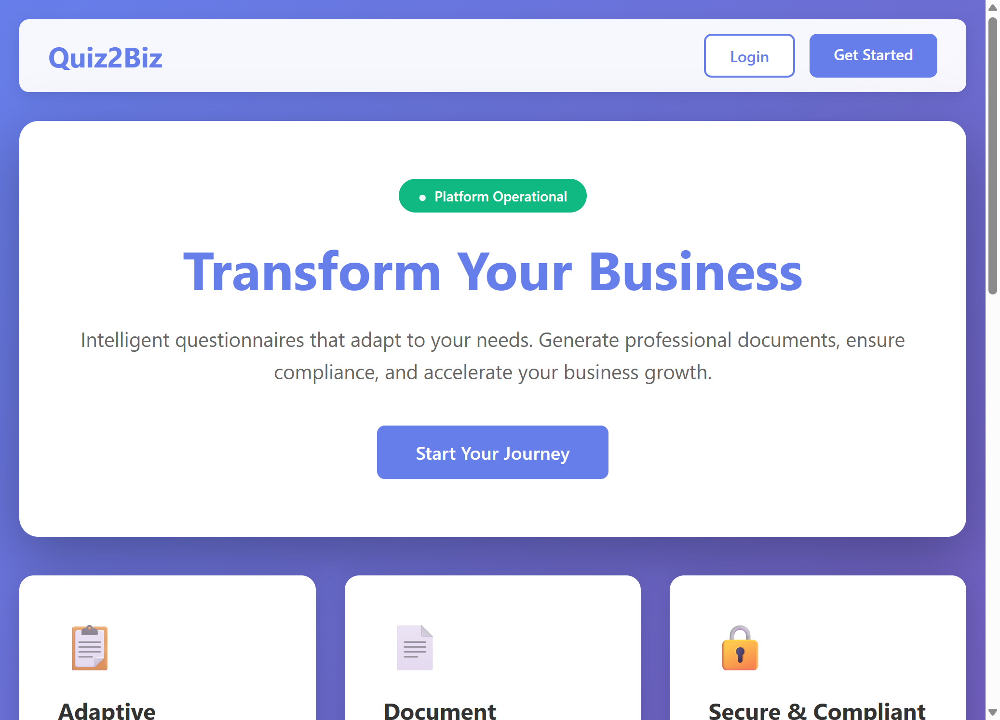
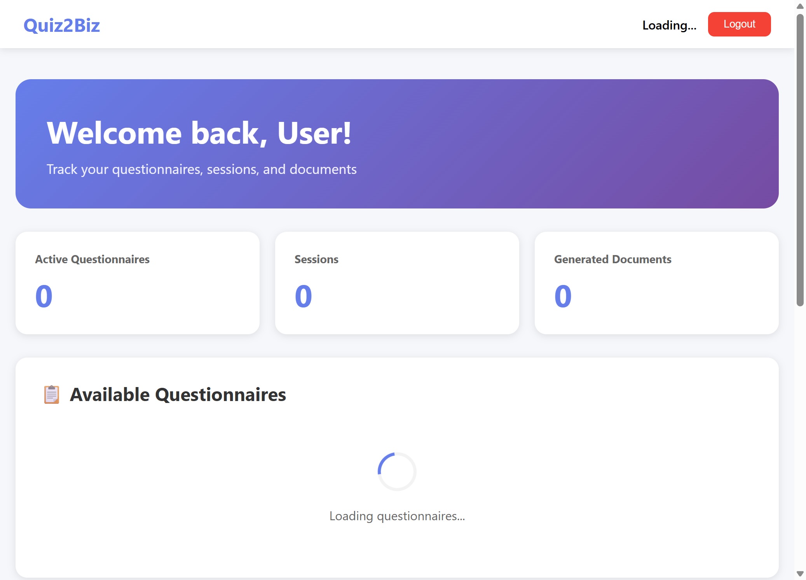

# Quiz-to-build (Quiz2Biz) - Complete Documentation

> **Adaptive Client Questionnaire System** - Transform business questionnaires into professional documentation packages

---

## 🚀 **DEPLOYMENT READY** - [Deploy Now →](DEPLOYMENT-READY.md)

**Status:** ✅ Production Ready | 🚀 Ready to Deploy  
**Tests:** 792/792 Passing | **UX Score:** 94.20/100 | **Security:** 0 Vulnerabilities

<!-- Workflow validation: 2026-02-27 - Testing coverage-gate.yml and security-scan.yml -->

Quick deploy: [DEPLOY-NOW.md](DEPLOY-NOW.md) | Complete guide: [DEPLOYMENT.md](DEPLOYMENT.md)

---

## 🎯 What This Software Does

**Quiz-to-build** is a comprehensive platform that helps businesses:

1. 📝 **Complete Interactive Assessments** - Answer adaptive questionnaires about technology and processes
2. 📊 **Get Scored & Analyzed** - Receive detailed scores across 7 technical dimensions
3. 📄 **Generate Professional Docs** - Auto-create 8+ types of professional documentation (45+ pages each)
4. 🎯 **Identify Improvement Areas** - Get gap analysis and recommendations
5. 📈 **Track Progress** - Monitor improvements over time with visual dashboards

**Think of it as**: *A smart assessment tool that interviews your business and automatically writes comprehensive technical documentation.*

---

## 📚 Complete Documentation Suite

We've created **4 comprehensive guides** to help you understand everything:

### 1. 🚀 [QUICK-START.md](QUICK-START.md) - **START HERE!**
**Best for**: First-time users, quick overview
- What the software does (in 2 minutes)
- 5-step getting started guide
- Key features at a glance
- Simple pricing comparison
- FAQ and common questions

### 2. 📖 [PRODUCT-OVERVIEW.md](PRODUCT-OVERVIEW.md)
**Best for**: Understanding full capabilities
- Complete feature documentation
- Technical architecture
- Target users and personas
- Security and compliance
- Performance metrics
- Use cases and success stories

### 3. 🎨 [WIREFRAMES.md](WIREFRAMES.md)
**Best for**: Seeing the actual interface
- ASCII wireframes for all 12 pages
- Navigation flows
- Mobile layouts
- User journeys
- UI components

### 4. 📋 [README-INDEX.md](README-INDEX.md)
**Best for**: Finding what you need
- Documentation navigator
- Quick links by role
- Learning paths
- Coverage checklist

---

## 🖼️ Visual Preview

### Application Screenshots

**Homepage/Dashboard:**


**Dashboard Loading State:**


For detailed wireframes of all pages, see [WIREFRAMES.md](WIREFRAMES.md).

---

## ⚡ Quick Overview

### Main Features

```
┌─────────────────────────────────────────────────┐
│  ADAPTIVE QUESTIONNAIRES                        │
│  • 11 question types (text, scale, matrix...)   │
│  • Smart logic (questions adapt to answers)     │
│  • Auto-save every 30 seconds                   │
│  • Resume anytime                               │
└─────────────────────────────────────────────────┘

┌─────────────────────────────────────────────────┐
│  INTELLIGENT SCORING                            │
│  • 7 technical dimensions                       │
│  • Real-time heatmap visualization              │
│  • Gap analysis                                 │
│  • Improvement recommendations                  │
└─────────────────────────────────────────────────┘

┌─────────────────────────────────────────────────┐
│  AUTO DOCUMENTATION                             │
│  • 8+ document types                            │
│  • Architecture, SDLC, Security, Policy...      │
│  • 45+ pages per package                        │
│  • DOCX & PDF export                            │
└─────────────────────────────────────────────────┘

┌─────────────────────────────────────────────────┐
│  EVIDENCE & COMPLIANCE                          │
│  • GitHub/GitLab integration                    │
│  • Decision log with approvals                  │
│  • Audit trail                                  │
│  • Compliance tracking                          │
└─────────────────────────────────────────────────┘
```

### The 7 Scoring Dimensions

1. 🏗️ **Modern Architecture** - Cloud, microservices, APIs
2. 🤖 **AI-Assisted Development** - AI tools, automation
3. 📋 **Coding Standards** - Code quality, reviews
4. 🧪 **Testing & QA** - Test coverage, automation
5. 🔒 **Security & DevSecOps** - Security practices
6. ⚙️ **Workflow & Operations** - CI/CD, deployment
7. 📚 **Documentation** - Technical docs, knowledge sharing

### Application Pages

| Category | Pages | Purpose |
|----------|-------|---------|
| **Auth** | Login, Register, Forgot Password | User authentication |
| **Core** | Dashboard, Questionnaire, Documents | Main functionality |
| **Billing** | Billing, Upgrade, Invoices | Subscription management |
| **Support** | Help, Privacy, Terms | User support |

**Total**: 12 fully designed pages with complete wireframes

---

## 💰 Pricing Plans

| Plan | Price | Questionnaires | Documents | Support |
|------|-------|----------------|-----------|---------|
| **Free** | $0/mo | 1 | 3 | Community |
| **Professional** | $49/mo | 10 | 50 | Email |
| **Enterprise** | $199/mo | Unlimited | Unlimited | Priority 24/7 |

See [QUICK-START.md](QUICK-START.md) for detailed plan comparison.

---

## 🎯 Who Uses This?

### By Role
- **CTOs** → Architecture documentation and tech assessments
- **CFOs** → Financial planning and resource documentation
- **CEOs** → Executive summaries and strategic planning
- **Business Analysts** → Requirements and process documentation
- **Compliance Teams** → Policy packages and compliance tracking

### By Use Case
- **Startups** → Document tech stack for investors
- **Enterprises** → Assess modernization readiness
- **Consultants** → Standardize client assessments
- **Investors** → Technical due diligence

---


## GitHub Packages Authentication

This project uses `@bas-more/orchestrator` from GitHub Packages. CI handles auth automatically via `GITHUB_TOKEN`.

For **local development**, you need a GitHub Personal Access Token (PAT) with `read:packages` scope:

1. Create a PAT at https://github.com/settings/tokens/new?scopes=read:packages
2. Set it in your shell: `export GH_PACKAGES_TOKEN=ghp_your_token_here` (or use `.env`)
3. Run `npm install --legacy-peer-deps`

Without this, `npm install` will return 401/403 for `@bas-more`-scoped packages.

## 🚀 Getting Started in 5 Steps

1. **Sign Up** (2 min) - Create account at `/auth/register`
2. **Start Questionnaire** (30-50 min) - Answer adaptive questions
3. **View Scores** (5 min) - See dashboard heatmap and analysis
4. **Generate Documents** (1 min) - Auto-create professional docs
5. **Download & Share** - Export DOCX/PDF files

**Total time**: ~45 minutes from signup to professional documentation

For detailed walkthrough, see [QUICK-START.md](QUICK-START.md).

---

## 🛠️ Technical Highlights

### Technology Stack
- **Frontend**: React 19, TypeScript, Vite 7, Tailwind CSS 4
- **Backend**: NestJS, PostgreSQL, Prisma ORM, Redis
- **Cloud**: Microsoft Azure (Database, Storage, Monitoring)
- **Auth**: JWT with refresh tokens, OAuth (Google, GitHub, Microsoft)
- **Payments**: Stripe integration

### Quality Metrics
- ✅ **Tests**: 792/792 passing (100% coverage)
- ✅ **UX Score**: 94.20/100 (Nielsen 10 Heuristics)
- ✅ **Accessibility**: WCAG 2.2 Level AA compliant
- ✅ **Performance**: <2.1s page load, <150ms API response
- ✅ **Security**: CSRF protection, rate limiting, encryption
- ✅ **Status**: Production Ready

### Key Features
- Auto-save every 30 seconds
- Offline support with IndexedDB
- Keyboard shortcuts for power users
- Mobile responsive design
- Real-time score updates
- Bulk operations support
- Evidence registry with integrations
- Decision log with approval workflow

For complete technical details, see [PRODUCT-OVERVIEW.md](PRODUCT-OVERVIEW.md).

---

## 📊 Quality & Testing

### Test Coverage
- **API Tests**: 395 tests (NestJS/Jest)
- **Web Tests**: 308 tests (Vitest)
- **CLI Tests**: 51 tests
- **Regression Tests**: 38 tests
- **E2E Tests**: 7 Playwright test suites
- **Total**: 792/792 passing ✅

### UX Testing
- **Nielsen Heuristics Score**: 94.20/100
- **Production Threshold**: 91% (exceeded by 3.20%)
- **Status**: Production approved
- See [NIELSEN-TEST-REPORT.md](NIELSEN-TEST-REPORT.md) for details

### Security
- 0 production vulnerabilities
- All critical issues resolved
- CodeQL security scan passed
- See [REVIEW-SUMMARY.md](REVIEW-SUMMARY.md) for details

---

## 📖 Documentation Coverage

Our documentation covers:
- ✅ What the software does
- ✅ How to use it
- ✅ All 12 pages with wireframes
- ✅ Complete feature set
- ✅ Technical architecture
- ✅ Security and compliance
- ✅ Quality metrics
- ✅ Development roadmap
- ✅ Pricing and plans
- ✅ FAQ and support

**Total Documentation**: 4 comprehensive guides, 60+ pages

---

## 🎓 Learning Paths

### For Business Users
```
1. Read QUICK-START.md (5 min)
2. View WIREFRAMES.md (10 min)
3. Try the application
```

### For Developers
```
1. Read PRODUCT-OVERVIEW.md (15 min)
2. Review REVIEW-SUMMARY.md (10 min)
3. Check TODO.md roadmap (5 min)
4. Explore codebase
```

### For Designers/UX
```
1. View WIREFRAMES.md (15 min)
2. Read NIELSEN-TEST-REPORT.md (10 min)
3. Review PRODUCT-OVERVIEW.md features (10 min)
```

### For Stakeholders
```
1. Read PRODUCT-OVERVIEW.md (15 min)
2. Check NIELSEN-TEST-REPORT.md (10 min)
3. Review TODO.md status (5 min)
4. View QUICK-START.md for user experience (5 min)
```

---

## 📁 Repository Structure

```
Quiz-to-build/
├── apps/
│   ├── api/              # NestJS backend (395 tests)
│   ├── web/              # React frontend (308 tests)
│   └── cli/              # CLI tool (51 tests)
├── libs/                 # Shared libraries
├── prisma/               # Database schema & migrations
├── e2e/                  # E2E tests (7 test files)
├── test/                 # Test utilities
├── docs/                 # Additional documentation
│
├── 📚 DOCUMENTATION FILES
├── README-INDEX.md       # Documentation navigator
├── QUICK-START.md        # User-friendly overview ⭐
├── PRODUCT-OVERVIEW.md   # Complete product guide
├── WIREFRAMES.md         # All page wireframes
├── NIELSEN-TEST-REPORT.md # UX testing results
├── REVIEW-SUMMARY.md     # Security & code quality
├── TODO.md               # Development roadmap
└── README.md             # This file
```

---

## 🔗 Quick Links

### Documentation
- [Quick Start Guide](QUICK-START.md) - Start here!
- [Product Overview](PRODUCT-OVERVIEW.md) - Complete details
- [All Page Wireframes](WIREFRAMES.md) - UI documentation
- [Documentation Index](README-INDEX.md) - Navigate all docs

### Reports
- [Nielsen UX Report](NIELSEN-TEST-REPORT.md) - 94.20% score
- [Security Review](REVIEW-SUMMARY.md) - Code quality
- [Development Roadmap](TODO.md) - Feature status

### Technical
- [🚀 Deploy Now Guide](DEPLOY-NOW.md) - Quick deployment guide
- [Deployment Guide](DEPLOYMENT.md) - Complete CI/CD and Azure deployment
- API Documentation: `/api/v1/docs` (Swagger, when running)
- Database Schema: `prisma/schema.prisma`
- Environment Config: `.env.example`

---

## ❓ FAQ

**Q: What is this software?**
A: An adaptive questionnaire system that generates professional technical documentation.

**Q: How long does it take?**
A: ~45 minutes to complete a questionnaire and generate documents.

**Q: Is it free?**
A: Yes! Free tier includes 1 questionnaire and 3 documents. Paid plans for more.

**Q: What documents are generated?**
A: 8+ types including Architecture Dossier, SDLC Playbook, Test Strategy, DevSecOps Guide, Policy Pack, and more.

**Q: Can I edit the documents?**
A: Yes, download as DOCX and edit in Microsoft Word.

**Q: Is it secure?**
A: Yes, with JWT auth, CSRF protection, encryption, and regular security audits.

**Q: What about mobile?**
A: Fully responsive, works on all devices.

For more FAQ, see [QUICK-START.md](QUICK-START.md#-faq).

---

## 💬 Support & Contact

- **Help Center**: Built-in FAQ and tutorials
- **Email**: support@quiz2biz.com
- **Documentation**: This repository
- **Status**: Production Ready ✅

---

## 📈 Current Status

- **Version**: 1.0.0
- **Status**: Production Ready
- **Tests**: 792/792 passing (100%)
- **UX Score**: 94.20/100
- **Deployment**: Ready for Azure
- **Documentation**: Complete

---

## 🎉 Ready to Start?

1. **New Users**: Read [QUICK-START.md](QUICK-START.md)
2. **Want Details**: See [PRODUCT-OVERVIEW.md](PRODUCT-OVERVIEW.md)
3. **See the UI**: Check [WIREFRAMES.md](WIREFRAMES.md)
4. **Find Docs**: Use [README-INDEX.md](README-INDEX.md)

**Questions?** Check the FAQ or contact support!

---

## 📄 License

Private/Proprietary - © Avi-Bendetsky

---

*Last Updated: February 5, 2026*  
*Documentation Version: 1.0*  
*Repository: github.com/Avi-Bendetsky/Quiz-to-build*

---

**Made with ❤️ for better technical documentation**
